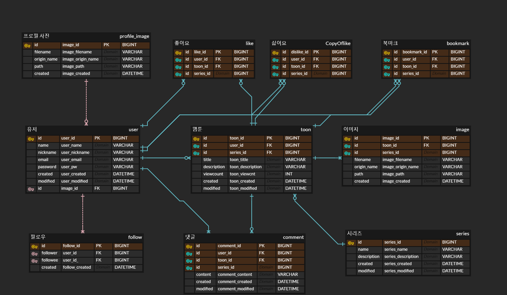

# Petit Toon Server
Short WebToon Platform API Server (2023.07 ~ 2023.09)

## Member
| 이용우                                         | 김지훈                                    |
|---------------------------------------------|----------------------------------------|
|[@timel2ss](https://www.github.com/timel2ss) | [@Hotoran](https://github.com/Hotoran) |


## 🛠 기술스택

- **Java 17**, **Spring Boot 3.1.1**
- **Spring Web MVC**, **Spring Rest Docs**
- **Spring Security**, **JWT**
- **Spring Data JPA**, **QueryDSL**, **Redis**, **PostgreSQL**
- **JUnit5**, **Mockito**, **Gradle**

## 💾 ER-Diagram


## 📄 API Documents
[API Documents](https://timel2ss.github.io/petit-toon-server/)

## ✔ 기여한 사항
- 엔티티 설계
- 팔로우, 검색, 피드, 랭크, 좋아요, 예외처리
- 회원가입, 로그인
- 서비스 배포 (GCP - Compute Engine)

## 📋 Issues
<details>
<summary>좋아요 버튼을 누를 때마다 DB에 쿼리 요청되는 문제</summary>

- Redis의 Bitmap Collection으로 메모리에 좋아요 정보를 캐싱
  -  [RedisUtil: Bitmap Collection 처리 구현](https://github.com/timel2ss/petit-toon-server/blob/master/src/main/java/com/petit/toon/util/RedisUtil.java)
- 좋아요 버튼을 누르면 DB에 Access되지 않고 Redis에서 처리
  - [LikeService: 좋아요 처리 로직](https://github.com/timel2ss/petit-toon-server/blob/master/src/main/java/com/petit/toon/service/cartoon/LikeService.java)
- 스케줄링 + 배치 처리로 Redis와 DB 동기화
  - [LikeScheduler: 동기화 로직 (스케줄링 + 배치처리)](https://github.com/timel2ss/petit-toon-server/blob/master/src/main/java/com/petit/toon/service/cartoon/LikeScheduler.java)
</details>

<details>
<summary>HTTP Request/Response 패킷에 Cookie가 전달되지 않는 문제</summary>

로그인 시 AccessToken과 RefreshToken을 HttpOnly 상태의 Cookie를 전달

- CORS 설정
  - 개발 환경에서는 CORS 설정을 모두 허용
  - [SecurityConfig: CORS 설정](https://github.com/timel2ss/petit-toon-server/blob/master/src/main/java/com/petit/toon/config/SecurityConfig.java)

- Cookie의 SameSite 옵션
  - Chrome 브라우저 기준 Lax 옵션이 기본값으로 설정
  - none 옵션을 사용하려면 https를 사용해야 Cookie가 전달됨
  - Lax 옵션에서는 서트 파티쿠키가 전송되지 않음
    - SameSite가 아니면 Cookie가 전달되지 않음
    - API 서버를 서브 도메인으로 추가하여 도메인 주소를 맞춰주어 해결
  - [CookieUtil: Cookie 설정](https://github.com/timel2ss/petit-toon-server/blob/master/src/main/java/com/petit/toon/util/CookieUtil.java)
</details>

<details>
<summary>빌드된 후에 생성된 static resource를 찾을 수 없는 문제</summary>

- 업로드한 이미지 파일은 로컬에 저장됨
- jar로 빌드한 후에 생성된 이미지 파일을 찾을 수 없음 (404 NOT FOUND)
- [WebConfig: 로컬에 저장된 resource에 대한 경로 설정](https://github.com/timel2ss/petit-toon-server/blob/master/src/main/java/com/petit/toon/config/WebConfig.java)
```java
@Override
public void addResourceHandlers(ResourceHandlerRegistry registry) {
    registry.addResourceHandler("/resources/**")
            .addResourceLocations("file:" + File.separator + path);
}
```
</details>

<details>
<summary>JVM Cannot allocate memory 문제로 서비스 장애</summary>

- 배포 환경에서 SWAP File의 크기를 2GB로 확장하여 메모리 문제 해결
</details>


